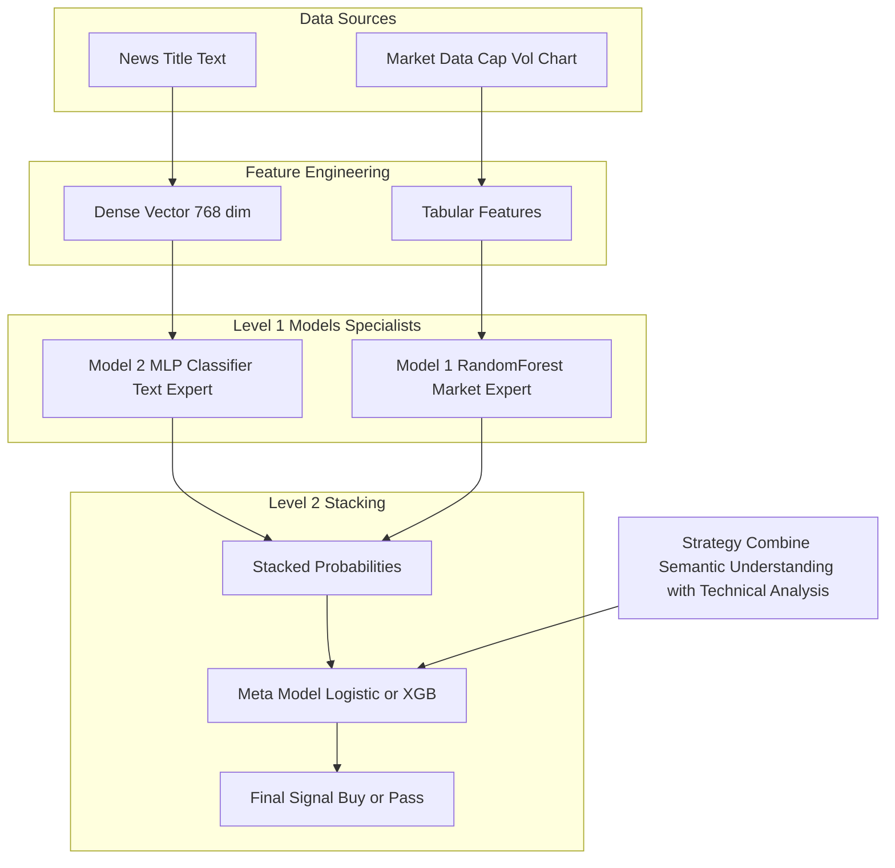

# BERT 임베딩 및 MLP 스태킹 전략 (BERT Embedding & MLP Stacking Strategy)

## 로직 요약 (Summary)

기존 키워드 기반(Bag-of-Words) 분석의 한계를 극복하고, 인간이 뉴스를 읽을 때 문맥(Context)을 파악하는 인지 과정을 모사하기 위해 **BERT(DeBERTa)** 모델을 도입했습니다. 추출된 고차원 텍스트 임베딩 벡터를 효과적으로 학습하기 위해 **MLP(Multi-Layer Perceptron)**를 Model 2로 선정하였으며, 이를 기존의 정형 데이터 강자인 **RandomForest(Model 1)**와 결합하는 **하이브리드 스태킹(Hybrid Stacking)** 전략을 수립했습니다.

## 아키텍처 (Architecture)




## 배경 및 문제 정의 (Background & Problem Definition)

### 1. 단순 회귀(Regression) 및 키워드 분석의 한계

- **회귀의 난이도:** 금융 데이터의 극심한 노이즈로 인해, 뉴스만으로 구체적인 수익률(Regression)을 직접 예측하는 것은 정확도가 매우 낮았습니다.
- **키워드의 한계:** 기존 트리 모델은 "삼성전자", "급등" 같은 특정 단어의 유무만 판단했습니다. 하지만 "실적 우려로 급락"과 "저가 매수세로 반등"처럼, 같은 단어가 쓰여도 문맥에 따라 정반대의 의미를 갖는 경우를 구분하지 못했습니다.

### 2. 인지적 모사 (Cognitive Mimicry)

- **트레이더의 사고방식:** 실제 트레이더는 뉴스 제목에서 단어만 뽑아내는 것이 아니라, 문장 전체의 **뉘앙스(호재/악재/불확실성)**를 읽어냅니다.
- **결론:** 기계도 단어(Token)가 아닌 **문장의 의미(Semantics)**를 이해해야 승률을 높일 수 있다고 판단했습니다.

## 해결 전략 (Solution Strategy)

### 1. BERT(DeBERTa) 도입: 문맥의 벡터화

인간의 독해 능력을 모사하기 위해, 한국어 금융 도메인에 특화된 `upskyy/kf-deberta-multitask` 모델을 사용하여 뉴스 제목을 768차원의 **임베딩 벡터(Embedding Vector)**로 변환했습니다. 이를 통해 단어의 단순 나열이 아닌, 문장 전체의 압축된 의미 정보를 확보했습니다.

### 2. Model 2로 MLP(신경망) 선정 이유

임베딩 벡터를 학습하는 모델로 RandomForest가 아닌 **MLP**를 선택한 이유는 데이터의 특성 때문입니다.

- **RandomForest (Tree):** 데이터를 수직/수평으로 자르는(Split) 방식입니다. 각 차원이 독립적인 의미를 가질 때(예: 시가총액, PER) 유리합니다.
- **MLP (Neural Network):** 모든 입력값을 가중치와 함께 섞어서(Linear Combination) 판단합니다. 임베딩 벡터처럼 **모든 숫자가 유기적으로 결합되어 의미를 형성하는 밀집(Dense) 데이터**를 해석하는 데 이론적으로 훨씬 적합합니다.

### 3. 스태킹 앙상블 (Stacking Ensemble) 계획

서로 다른 장점을 가진 두 모델을 결합하여 시너지를 냅니다.

- **Model 1 (RandomForest):** 재무제표, 수급, 차트 등 **정형 데이터(Tabular)** 해석 전문가.
- **Model 2 (BERT + MLP):** 뉴스 텍스트의 **비정형 의미(Semantic)** 해석 전문가.
- **Meta Model:** 위 두 전문가의 의견(예측 확률)을 종합하여 최종 매매 의사결정을 내립니다.


## 상세 과정 (Detailed Steps)

**1. 모델 로딩 및 GPU 가속 설정**  
대규모 연산이 필요한 BERT 모델을 효율적으로 구동하기 위해 PyTorch(`torch`)를 사용하여 모델을 로드하고, CUDA(GPU) 환경으로 이동시킵니다.

**Code Snippet: [test4(BERT).ipynb](vscode-file://vscode-app/c:/Users/%EC%86%90%EB%AF%BC%EA%B5%AC/AppData/Local/Programs/Microsoft%20VS%20Code/resources/app/out/vs/code/electron-browser/workbench/workbench.html) 

```python
# 0. 모델 및 토크나이저 로딩
model_id = "upskyy/kf-deberta-multitask"
print("모델 및 토크나이저 로딩을 시작합니다...")

# AutoTokenizer와 AutoModel을 사용하여 모델과 토크나이저를 직접 로드
tokenizer = AutoTokenizer.from_pretrained(model_id)
model = AutoModel.from_pretrained(model_id)

# GPU 사용 설정
device = "cuda" if torch.cuda.is_available() else "cpu"
model.to(device)
```

**2. 텍스트 전처리 (종목명 제거)**  
모델이 특정 종목명(예: "삼성전자")에 과적합되는 것을 방지하고 순수한 문맥(호재/악재)만 학습하도록, 뉴스 제목에서 종목명과 특수문자를 제거합니다.

**Code Snippet: [test4(BERT).ipynb](vscode-file://vscode-app/c:/Users/%EC%86%90%EB%AF%BC%EA%B5%AC/AppData/Local/Programs/Microsoft%20VS%20Code/resources/app/out/vs/code/electron-browser/workbench/workbench.html) 

```python
def clean_text_for_embedding(df):
    # ... (중략) ...
    # --- 1단계: 각 title에서 해당하는 name 제거 ---
    df_copy['cleaned_title'] = df_copy.apply(
        lambda row: row['title'].replace(row['name'], '') if pd.notna(row['name']) and pd.notna(row['title']) and row['name'] in row['title'] else row['title'],
        axis=1
    )
    # ... (중략) ...
    return df_copy
```

**3. 임베딩 벡터 추출 (PyTorch Inference)**  
전처리된 텍스트를 배치(Batch) 단위로 처리하여 768차원의 벡터로 변환합니다. `torch.no_grad()`와 `autocast`를 사용하여 메모리 사용량을 줄이고 연산 속도를 최적화했습니다.

**Code Snippet: [test4(BERT).ipynb](vscode-file://vscode-app/c:/Users/%EC%86%90%EB%AF%BC%EA%B5%AC/AppData/Local/Programs/Microsoft%20VS%20Code/resources/app/out/vs/code/electron-browser/workbench/workbench.html)**

```python
    for i in range(0, len(texts), batch_size):
        batch = texts[i:i+batch_size]
        enc = tokenizer(
            batch,
            padding=True,
            truncation=True,
            max_length=max_length,
            return_tensors="pt"
        )
        
        # ... (토큰 저장 로직 생략) ...
        
        enc = {k: v.to(dev) for k, v in enc.items()}

        with torch.no_grad():
            use_amp = (dev.type == "cuda")
            ctx = torch.cuda.amp.autocast(enabled=use_amp)
            with ctx:
                outputs = model(**enc)
                last_hidden = outputs.last_hidden_state
                pooled = _mean_pool(last_hidden, enc["attention_mask"])
                # ...
        all_chunks.append(pooled.detach().cpu())
```


**4. 시계열 데이터 분할 (Chronological Split)**  
추출된 임베딩 데이터(`X_emb`)를 학습 데이터로 설정하고, 미래 데이터 참조(Look-ahead Bias)를 방지하기 위해 시간 순서대로 Train/Validation/Test 셋을 분할합니다.

**Code Snippet: [test4(BERT).ipynb](vscode-file://vscode-app/c:/Users/%EC%86%90%EB%AF%BC%EA%B5%AC/AppData/Local/Programs/Microsoft%20VS%20Code/resources/app/out/vs/code/electron-browser/workbench/workbench.html)**

```python
# 1. 독립 변수(X) 정의
X = X_emb
y = df['WL']

# ... (중략) ...

# 1. 전체 데이터의 크기를 기준으로 분할 지점을 정합니다.
train_size = int(len(df) * 0.7)
val_size = int(len(df) * 0.85)

# 2. iloc를 사용하여 X와 y를 시간 순서대로 자릅니다.
X_70 = X.iloc[:train_size]
X_70_85 = X.iloc[train_size:val_size]
# ...
```

**5. MLP 모델 정의 및 학습**  
임베딩 벡터와 같은 밀집 데이터(Dense Data) 학습에 적합한 MLP(Multi-Layer Perceptron)를 사용하여 분류 모델을 학습합니다. 2개의 은닉층(100, 50)을 구성하여 비선형적인 문맥 정보를 학습합니다.

**Code Snippet: [test4(BERT).ipynb](vscode-file://vscode-app/c:/Users/%EC%86%90%EB%AF%BC%EA%B5%AC/AppData/Local/Programs/Microsoft%20VS%20Code/resources/app/out/vs/code/electron-browser/workbench/workbench.html)**

```python
print("MLP 모델 정의...")
mlp_model = MLPClassifier(
    hidden_layer_sizes=(100, 50),
    activation='relu',
    solver='adam',
    max_iter=500,
    verbose=True,
    early_stopping=True,
    random_state=42,
)

# --- 모델 훈련 ---
print("\nMLP 모델 훈련 시작...")
mlp_model.fit(X_train, y_train)
```

## 결과/효과 (Results/Impact)

- **문맥 인지:** 단순 단어 유무가 아닌 문장의 의미론적 특징(Semantic Feature)을 768차원 벡터로 수치화했습니다.
- **모델 다양성 확보:** 기존 정형 데이터 기반의 RandomForest 모델과 구조적으로 다른 신경망(MLP) 모델을 확보하여, 향후 스태킹(Stacking) 앙상블 시 상호 보완적인 예측 성능을 기대할 수 있습니다.