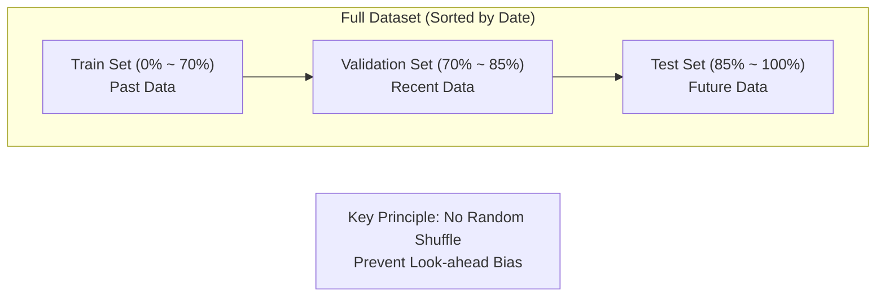

# 시계열 데이터 검증을 위한 순차적 분할 (Chronological Split for Time-Series Validation)

## 로직 요약 (Summary)

주식 뉴스 데이터와 같은 시계열(Time-Series) 데이터의 특성을 고려하여, 무작위 섞기(Random Shuffle) 대신 **시간 순서(Chronological Order)를 유지한 채 데이터를 분할**하는 검증 전략입니다. 이를 통해 모델이 미래의 정보를 미리 학습하는 **데이터 누수(Data Leakage)**를 방지하고, 실제 트레이딩 환경과 유사하게 "과거 데이터로 학습하여 미래를 예측"하는 성능을 평가합니다.

## 아키텍처 (Architecture)

전체 데이터셋을 시간 축(Time Axis)을 따라 **Train(과거) → Validation(중간) → Test(미래)** 순서로 배치하여 분할하는 구조입니다.



## 상세 과정 (Detailed Steps)

**1. 데이터 정렬 및 분할 지점 계산**  
데이터가 시간 순서대로 정렬되어 있기 때문에, 전체 데이터 길이를 기준으로 학습(70%), 검증(15%), 테스트(15%) 세트의 분할 인덱스를 계산합니다.

**Code Snippet: [test3(classification).ipynb](vscode-file://vscode-app/c:/Users/%EC%86%90%EB%AF%BC%EA%B5%AC/AppData/Local/Programs/Microsoft%20VS%20Code/resources/app/out/vs/code/electron-browser/workbench/workbench.html)**

```python
# 1. 전체 데이터의 크기를 기준으로 분할 지점을 정합니다.
# 예: Train 70%, Validation 15%, Test 15%
train_size = int(len(df) * 0.7)
val_size = int(len(df) * 0.85)
```

**2. 순차적 데이터 슬라이싱 (Chronological Slicing)**  
`iloc`를 사용하여 인덱스 기반으로 데이터를 잘라냅니다. 이때 `shuffle=False` 효과를 내어 시간적 연속성을 유지합니다.

**Code Snippet: [test3(classification).ipynb](vscode-file://vscode-app/c:/Users/%EC%86%90%EB%AF%BC%EA%B5%AC/AppData/Local/Programs/Microsoft%20VS%20Code/resources/app/out/vs/code/electron-browser/workbench/workbench.html)**

```python
# 2. iloc를 사용하여 X와 y를 시간 순서대로 자릅니다.
X_70 = X.iloc[:train_size]        # Train: 과거
X_70_85 = X.iloc[train_size:val_size] # Val: 최근
X_85_100 = X.iloc[val_size:]      # Test: 미래
```

**3. 기간 검증 (Validation of Time Ranges)**  
분할된 데이터가 실제로 시간 순서대로 잘 나뉘었는지 날짜 컬럼을 통해 확인합니다.

**Code Snippet: [test3(classification).ipynb](vscode-file://vscode-app/c:/Users/%EC%86%90%EB%AF%BC%EA%B5%AC/AppData/Local/Programs/Microsoft%20VS%20Code/resources/app/out/vs/code/electron-browser/workbench/workbench.html)**

```python
# 기간 확인 (df의 'date' 컬럼을 사용)
print(f"0~0.7 기간: {df['date'].iloc[0]} ~ {df['date'].iloc[train_size-1]}")
print(f"0.7~0.85 기간: {df['date'].iloc[train_size]} ~ {df['date'].iloc[val_size-1]}")
```

## 결과/효과 (Results/Impact)

- **Look-ahead Bias 제거:** 랜덤 분할 시 발생할 수 있는 "미래 뉴스를 보고 과거 주가를 예측"하는 논리적 오류를 원천 차단했습니다.
- **현실적 성능 평가:** 실제 서비스 환경(내일의 뉴스로 내일의 주가 예측)과 동일한 조건에서 모델을 평가할 수 있습니다.

## 향후 개선 계획 (Future Improvements)

- **Date-based Splitting:** 현재의 인덱스 기반 분할은 장(Market) 운영 시간 중 하루가 잘리는 경우가 발생할 수 있습니다. 향후에는 `2024-01-01`과 같이 **날짜(Date)를 기준으로 명확히 경계를 나누는 로직**으로 고도화하여, 일별 데이터의 완결성을 보장할 계획입니다.
- **Rolling Window CV:** 고정된 분할 대신, 시간 창을 조금씩 이동하며 검증하는**TimeSeriesSplit (Rolling Window)** 방식을 도입하여 검증의 신뢰도를 높일 예정입니다.

