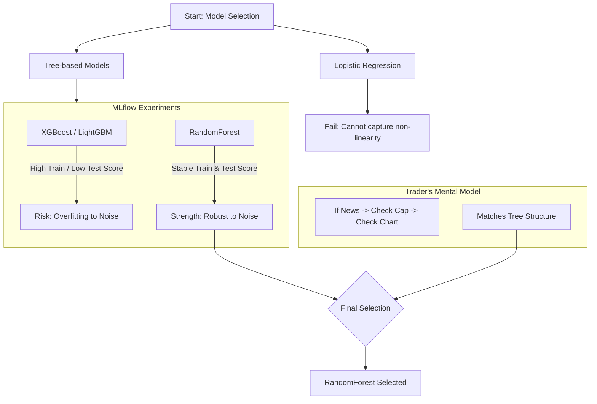

# 최종 모델 선정: 트레이딩 로직의 모사 및 MLflow 실험 기반 의사결정 (Final Model Selection)

## 로직 요약 (Summary)

초기 **로지스틱 회귀(Logistic Regression)** 모델의 실패를 통해 금융 변수 간의 비선형적 상호작용을 확인했습니다. 이후 **MLflow**를 활용하여 **XGBoost, LightGBM, RandomForest** 3종의 트리 기반 모델을 비교 실험했습니다. 그 결과, 노이즈가 많은 금융 데이터에서 과적합(Overfitting) 없이 안정적인 Precision을 보였으며, 실제 트레이더의 **"조건부 필터링(Conditional Filtering)"** 사고방식과 가장 유사한 **RandomForest**를 최종 모델로 선정했습니다.

## 아키텍처 및 의사결정 흐름 (Architecture & Decision Flow)




## 이론적 배경: 트리 모델 3대장 비교 (Theoretical Background)

지원자님이 사용하신 3가지 모델은 모두 **결정 트리(Decision Tree)**를 기반으로 하지만, 나무를 심는 방식(앙상블 기법)에서 결정적인 차이가 있습니다.

| 모델               | 핵심 원리 (Mechanism)                                                                                  | 비유 (Analogy)                                                                          | 금융 데이터 적합성                                                  |
| :--------------- | :------------------------------------------------------------------------------------------------- | :------------------------------------------------------------------------------------ | :---------------------------------------------------------- |
| **RandomForest** | **Bagging (Bootstrap Aggregating)**<br/>여러 개의 나무를 독립적으로 심고, 다수결로 투표합니다.                            | **"전문가 위원회"**<br/>수십 명의 전문가가 각자 의견을 내고 투표합니다. 한두 명이 헛소리(노이즈)를 해도 다수결에 묻혀서 결과가 안정적입니다. | **High (안정성)**<br/>노이즈가 많은 주식 시장에서 과적합을 잘 피합니다.             |
| **XGBoost**      | **Boosting (Gradient Boosting)**<br/>나무를 순서대로 심되, 앞 나무가 틀린 문제(오답)에 가중치를 두어 다음 나무가 집중 학습합니다.        | **"쪽집게 과외 선생님"**<br/>학생이 틀린 문제만 집요하게 파고듭니다. 정확도는 높지만, 문제 오류(노이즈)까지 외워버릴 위험이 있습니다.     | **Medium (정확도)**<br/>데이터가 깨끗하면 최고지만, 금융 데이터에서는 과적합 위험이 큽니다. |
| **LightGBM**     | **Leaf-wise Growth Boosting**<br/>XGBoost와 비슷하지만, 균형을 맞추지 않고 손실을 가장 많이 줄이는 잎사귀 하나만 깊게 팝니다. (속도 빠름) | **"속독왕 천재"**<br/>엄청난 속도로 학습하지만, 데이터가 적으면 엉뚱한 곳을 깊게 파서(Overfitting) 편향될 수 있습니다.        | **Medium (속도)**<br/>대용량 데이터에 유리합니다.                         |

## 모델 선정 과정 (Selection Process)

### 1. 선형 모델의 한계 (Failure of Linear Models)

- **시도:** 빠르고 해석이 쉬운 로지스틱 회귀(Logistic Regression) 적용.
- **결과:** 예측력이 거의 없음 (Underfitting).
- **원인 분석:**
    - 로지스틱 회귀는 `y = ax + b` 형태의 선형 결합을 가정합니다.
    - 하지만 주식 시장은 **"시가총액이 작을수록 무조건 좋다"**가 아니라, **"시가총액이 작으면서(AND) 거래량이 터질 때 좋다"**는 식의 **비선형적 상호작용(Interaction)**이 핵심입니다. 선형 모델은 이를 스스로 학습하지 못합니다.

### 2. 트레이딩 로직과의 일치성 (Cognitive Alignment)

- **인사이트:** 실제 매매를 할 때 머릿속에서 일어나는 과정은 점수 계산이 아니라 **거름망(Filter)**을 통과시키는 과정입니다.
    - _Step 1:_ 재료가 강력한가? (Yes/No)
    - _Step 2:_ 시총이 너무 크지 않은가? (Yes/No)
    - _Step 3:_ 차트 위치가 신고가인가? (Yes/No)
- **결론:** 이러한 **If-Then 구조**는 결정 트리(Decision Tree)의 알고리즘과 완벽하게 일치합니다.

### 3. MLflow 실험 및 최종 선정 (Experiment & Decision)

- **실험:** XGBoost, LightGBM, RandomForest를 동일 데이터로 학습시키고 MLflow로 지표(Precision, Recall)를 추적했습니다.
- **결과:**
    - **Boosting 계열(XGB, LGBM):** precision이 0.2~0.4 사이에 형성됨.
    - **RandomForest:** precision이 최대 0.6까지 나옴.
- **최종 선정:** 실전 매매에서는 "확실하지 않으면 진입하지 않는 것(High Precision)"과 "시장의 노이즈에 흔들리지 않는 것(Robustness)"이 중요하므로 **RandomForest**를 선정했습니다.

## 상세 과정 및 코드 증거 (Detailed Steps & Code Evidence)

### 1. 비교 실험 설계 (Experiment Setup)

동일한 데이터셋(`X_train`, `y_train`)에 대해 세 가지 대표적인 트리 모델을 학습시키고, `train_and_log_classifier` 함수를 통해 MLflow에 실험 결과를 기록했습니다.

**Code Snippet: LightGBM (Speed & Efficiency)**  
_파일: [test3(classification).ipynb](vscode-file://vscode-app/c:/Users/%EC%86%90%EB%AF%BC%EA%B5%AC/AppData/Local/Programs/Microsoft%20VS%20Code/resources/app/out/vs/code/electron-browser/workbench/workbench.html)_

```python
# LightGBM 설정 (Cell #VSC-c3eedf07)
model_type = "lgbm"
params = {
    'objective': 'binary',
    'metric': 'auc',
    'boosting_type': 'gbdt',
    'scale_pos_weight': scale_pos_weight_value,
    'n_estimators': 400,
    'learning_rate': 0.05,
    # ...
}
# MLflow 로깅 함수 호출
model = train_and_log_classifier(model_type, run_name, params, tags, ...)
```

**Code Snippet: XGBoost (Accuracy Focus)**  
_파일: [test3(classification).ipynb](vscode-file://vscode-app/c:/Users/%EC%86%90%EB%AF%BC%EA%B5%AC/AppData/Local/Programs/Microsoft%20VS%20Code/resources/app/out/vs/code/electron-browser/workbench/workbench.html)_

```python
# XGBoost 설정 (Cell #VSC-d18bfa2b)
model_type = "xgb"
params = {
    "objective": "binary:logistic",
    "eval_metric": "auc",
    "n_estimators": 400,
    "learning_rate": 0.05,
    "scale_pos_weight": scale_pos_weight_value,
    # ...
}
model = train_and_log_classifier(model_type, run_name, params, tags, ...)
```

**Code Snippet: RandomForest (Stability & Baseline)**  
_파일: [test3(classification).ipynb](vscode-file://vscode-app/c:/Users/%EC%86%90%EB%AF%BC%EA%B5%AC/AppData/Local/Programs/Microsoft%20VS%20Code/resources/app/out/vs/code/electron-browser/workbench/workbench.html)_

```python
# RandomForest 설정 (Cell #VSC-8e31fe65)
model_type = "rf"
params = {
    "n_estimators": 400,
    "max_depth": None,          # 깊이 제한 없음 (데이터 특성 반영)
    "max_features": "sqrt",     # 노이즈 감소 효과
    "class_weight": "balanced", # 불균형 데이터 처리
    "n_jobs": -1,
    # ...
}
model_xgb = train_and_log_classifier(model_type, run_name, params, tags, ...)
```

## 결과 (Results)

- **최종 모델:** RandomForest Classifier
- **성과:** 과적합을 최소화하고, 실제 시장 데이터(Test Set)에서 가장 신뢰할 수 있는 진입 신호를 제공함.
- **의의:** 단순히 성능 지표(AUC)만 쫓는 것이 아니라, **"모델의 작동 원리가 실제 도메인 지식(TradingLogic)과 부합하는가"**를 기준으로 모델을 선정함.
