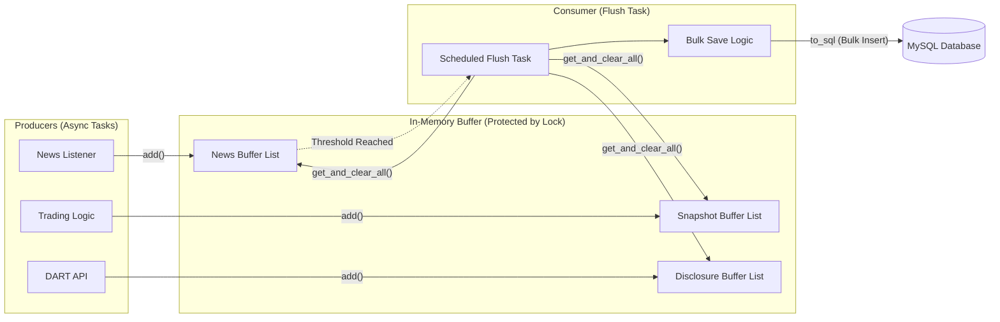

# 고성능 I/O 처리를 위한 인메모리 버퍼링 (In-Memory Buffering)

## 로직 요약 (Summary)

실시간으로 쏟아지는 뉴스 데이터와 트레이딩 로그를 즉시 DB에 저장(Insert)할 경우 발생하는 **I/O 병목과 커넥션 과부하**를 방지하기 위한 배치 처리(Batch Processing) 로직입니다. 데이터를 메모리 상의 버퍼(`Buffer` 클래스)에 임시 저장했다가, 일정 개수나 시간이 되면 `asyncio.Lock`을 통해 안전하게 한 번에 저장(Bulk Insert)하여 시스템 성능을 최적화했습니다.

## 아키텍처 (Architecture)

이 아키텍처는 여러 생산자(Producer)가 비동기적으로 데이터를 버퍼에 쌓고, 조건이 충족되면 소비자(Consumer)인 플러시 태스크가 DB에 일괄 기록하는 **Producer-Consumer 패턴**을 보여줍니다.



## 상세 과정 (Detailed Steps)

**1. 버퍼 초기화 및 Lock 생성**  
`Buffer` 클래스는 뉴스, 스냅샷(매매 로그), 공시 데이터를 각각 담을 리스트를 관리하며, 동시 접근 제어를 위해 `asyncio.Lock`을 생성합니다.

**Code Snippet: [buffer.py](vscode-file://vscode-app/c:/Users/%EC%86%90%EB%AF%BC%EA%B5%AC/AppData/Local/Programs/Microsoft%20VS%20Code/resources/app/out/vs/code/electron-browser/workbench/workbench.html)**

```python
class Buffer:
    def __init__(self):
        # 데이터 종류별 리스트 초기화
        self._buffers = {"news": [], "snapshot": [], "disclosure": []}
        # 동시성 제어를 위한 Lock
        self.lock = asyncio.Lock()
```

**2. 데이터 적재 (Thread-Safe Add)**  
여러 비동기 태스크(뉴스 수신, 매매 로직 등)가 동시에 데이터를 추가하려 할 때, `async with self.lock`을 사용하여 데이터 레이스(Data Race) 없이 안전하게 리스트에 추가합니다.

**Code Snippet: [buffer.py](vscode-file://vscode-app/c:/Users/%EC%86%90%EB%AF%BC%EA%B5%AC/AppData/Local/Programs/Microsoft%20VS%20Code/resources/app/out/vs/code/electron-browser/workbench/workbench.html)**

```python
async def add(self, name: str, data: Dict):
    async with self.lock:
        self._buffers[name].append(data)
```

**3. 플러시 조건 확인 (Threshold Check)**  
데이터를 무한정 메모리에 쌓을 수 없으므로, 특정 개수(예: 뉴스 100개) 이상 쌓이면 즉시 저장을 트리거하는 로직을 둡니다.

**Code Snippet: [buffer.py](vscode-file://vscode-app/c:/Users/%EC%86%90%EB%AF%BC%EA%B5%AC/AppData/Local/Programs/Microsoft%20VS%20Code/resources/app/out/vs/code/electron-browser/workbench/workbench.html)**

```python
def is_news_flush_needed(self):
    # Lock 없이 길이만 체크 (빠른 확인용)
    return len(self._buffers["news"]) >= self._news_max_size
```

**4. 데이터 인출 및 초기화 (Atomic Get & Clear)**  
저장 작업을 위해 데이터를 꺼낼 때, **"꺼내기"와 "비우기"가 원자적(Atomic)으로** 이루어져야 합니다. 그렇지 않으면 꺼내는 도중에 새로 들어온 데이터가 유실될 수 있습니다.

**Code Snippet: [buffer.py](vscode-file://vscode-app/c:/Users/%EC%86%90%EB%AF%BC%EA%B5%AC/AppData/Local/Programs/Microsoft%20VS%20Code/resources/app/out/vs/code/electron-browser/workbench/workbench.html)**

```python
async def get_and_clear_all(self) -> Dict[str, List[Dict]]:
    async with self.lock:
        # 1. 현재 버퍼의 내용을 복사 (Deep Copy)
        all_items = {name: buf[:] for name, buf in self._buffers.items()}
        # 2. 버퍼 비우기
        for name in self._buffers:
            self._buffers[name].clear()
        return all_items
```

**5. 일괄 저장 (Bulk Insert)**  
꺼낸 데이터는 `pandas`의 `DataFrame`으로 변환한 뒤, `to_sql` 메서드(SQLAlchemy)를 사용하여 DB에 한 번의 트랜잭션으로 저장합니다. 이는 건별 `INSERT`보다 압도적으로 빠릅니다.

**Code Snippet: [database.py](vscode-file://vscode-app/c:/Users/%EC%86%90%EB%AF%BC%EA%B5%AC/AppData/Local/Programs/Microsoft%20VS%20Code/resources/app/out/vs/code/electron-browser/workbench/workbench.html)**

```python
def save_dataframe(df, table_name, engine, if_exists='append'):
    # DataFrame을 이용한 Bulk Insert
    df.to_sql(name=table_name, con=engine, if_exists=if_exists, index=False)
```

**6. 데이터 보호 및 로직 은닉 (Encapsulation)**  
`Buffer` 클래스는 내부 저장소(`_buffers`)와 동시성 제어 도구(`lock`)를 클래스 내부로 숨기고(Private), 외부에는 안전한 인터페이스(`add`, `get_and_clear_all`)만 노출하는 **캡슐화(Encapsulation)** 패턴을 적용했습니다.

- **데이터 은닉 (Information Hiding):** 외부 모듈이 `_buffers` 리스트에 직접 접근하여 데이터를 조작하거나 실수로 삭제하는 것을 방지합니다.
- **로직 캡슐화:** `Lock`을 획득하고 해제하는 복잡한 동기화 로직을 메서드 내부로 숨겨, 사용하는 쪽(Main Logic)에서는 스레드 안전성을 신경 쓰지 않고 단순하게 메서드만 호출하면 되도록 설계했습니다.

**Code Snippet: [buffer.py](vscode-file://vscode-app/c:/Users/%EC%86%90%EB%AF%BC%EA%B5%AC/AppData/Local/Programs/Microsoft%20VS%20Code/resources/app/out/vs/code/electron-browser/workbench/workbench.html)**

```python
# 외부에서는 내부 구현(Lock, List 조작)을 몰라도 됨
# 단순히 "추가해줘"라고 요청하면, 내부에서 안전하게 처리함
async def add(self, name: str, data: Dict):
    async with self.lock:  # 동기화 로직이 캡슐화됨
        self._buffers[name].append(data)
```
