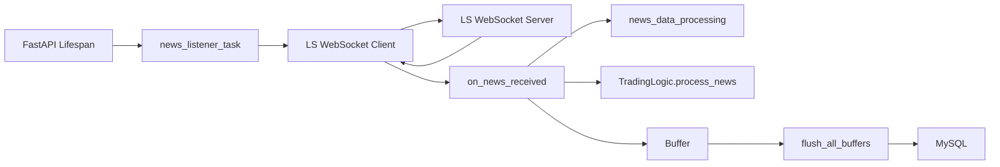

# LS 실시간 뉴스 WebSocket 수신 파이프라인 (Realtime News WebSocket Pipeline)

## 로직 요약 (Summary)

이 백엔드는 **LS OpenAPI의 WebSocket 서버에 클라이언트로 연결**하여 실시간 뉴스를 스트리밍으로 수신하고, 수신 즉시 **뉴스 전처리 → 매매 로직 비동기 실행 → DB 저장을 위한 버퍼 적재**로 이어지는 파이프라인을 구성합니다. HTTP REST 방식의 폴링(polling) 대신 WebSocket을 사용해 지연을 줄였고, 서버 시작/종료 시점에 백그라운드 태스크와 `stop_event`를 이용해 **안전한 종료와 재연결**을 구현했습니다.

## 아키텍처 (Architecture)

아래 구조는 “외부 WebSocket(LS) 수신”을 중심으로, 수신된 메시지가 내부 서비스로 어떻게 전파되는지 보여줍니다.



## 상세 과정 (Detailed Steps)

**1. 서버 시작 시 WebSocket 리스너를 백그라운드 태스크로 상주시킴**  

FastAPI `lifespan`에서 `news_listener_task`를 `asyncio.create_task`로 실행하여, HTTP 요청이 없어도 WebSocket 수신이 계속 돌아가도록 합니다.

**Code Snippet: `src\fapi\main.py` - lifespan 백그라운드 태스크 시작**

```python
# filepath: [main.py](http://_vscodecontentref_/0)
stop_event = asyncio.Event()
app.state.stop_event = stop_event
news_task = asyncio.create_task(news_listener_task(stop_event))
scheduler_task = asyncio.create_task(scheduled_flush_task(app.state.trading_service, stop_event))
yield
stop_event.set()
await app.state.trading_service.flush_all_buffers()
```

**2. WebSocket 연결이 끊기면 재연결 루프를 통해 복구함**  
`news_listener_task`는 `stop_event`가 set 되기 전까지 반복하며, `fetch_realtime_news`가 비정상 종료를 반환하면 대기 후 재접속합니다.

**Code Snippet: `src\fapi\main.py` - 재연결 루프**

```python
# filepath: [main.py](http://_vscodecontentref_/1)
while not stop_event.is_set():
    normal_closed = await fetch_realtime_news(ACCESS_TOKEN, on_news_received, stop_event=stop_event)
    if normal_closed is True:
        break
    await asyncio.wait_for(stop_event.wait(), timeout=10)
```

**3.  fetch_realtime_news 내부 동작 분석**
이 함수는 **"전화 걸기(Connect) -> 구독 신청(Send) -> 계속 듣기(Receive Loop)"**의 3단계로 동작합니다.

**Code Snippet: `src\fapi\ls_open_api.py` - WebSocket 연결 및 구독 요청**

```python
async def fetch_realtime_news(access_token, on_news_received, stop_event=None):
    uri = "wss://openapi.ls-sec.co.kr:9443/websocket"
    
    # 1. [전화 걸기] 서버와 연결 (async with)
    async with websockets.connect(uri, ...) as websocket:
        
        # 2. [구독 신청] "뉴스(NWS) 보내주세요"라고 요청 (await send)
        request_msg = { ... "body": {"tr_cd": "NWS", ...} }
        await websocket.send(json.dumps(request_msg))
        
        # 3. [계속 듣기] 서버가 말할 때마다 받음 (async for)
        async for message in websocket:
            # 4. [전달] 받은 메시지를 콜백 함수에게 넘김
            news_data = json.loads(message)
            await on_news_received(news_data)
```

**4. stop_event 기반으로 “정상 종료”를 처리함 (Graceful Shutdown)**  
서버 종료 시 `stop_event`가 set 되면, WebSocket을 `close`하고 `True`를 반환해 상위 루프가 정상 종료로 판단하도록 합니다.

**Code Snippet: `src\fapi\ls_open_api.py` - stop_event 기반 종료**

```python
# filepath: [ls_open_api.py](http://_vscodecontentref_/3)
if stop_event and stop_event.is_set():
    await websocket.close(code=1000, reason="shutdown")
    return True
```


**5. 수신 콜백에서 최소 검증 후 “가공 → 비동기 매매 → 버퍼 적재 → 조건부 플러시”로 전파함**  
`on_news_received`는 제목 길이/유효성 같은 최소 검증 후, `news_data_processing`으로 정규화된 dict를 만들고, 매매 로직은 `create_task`로 분리해 수신 경로를 가볍게 유지합니다. 모든 뉴스는 버퍼에 쌓고 임계치 도달 시 플러시를 비동기로 실행합니다.

**Code Snippet: `src\fapi\main.py` - on_news_received 핵심 흐름**

```python
# filepath: [main.py](http://_vscodecontentref_/4)
processed_news = news_data_processing(news_data, stock_cache)
asyncio.create_task(trading_service.process_news(processed_news))
await trading_service.add_to_news_buffer(processed_news)
if trading_service.buffer.is_news_flush_needed():
    asyncio.create_task(trading_service.flush_all_buffers())
```

**6. 뉴스 전처리에서 “매체명 매핑”과 “realtime 타임스탬프”를 부여함**  
LS 원본 메시지를 DB/로직에서 쓰기 쉬운 평탄한 구조로 바꾸고, `stock_cache`의 ID-매체 매핑을 이용해 `media`를 추가합니다.

**Code Snippet: `src\fapi\data_processing.py` - news_data_processing 핵심**

```python
# filepath: [data_processing.py](http://_vscodecontentref_/5)
media_name = get_media_name(id, stock_cache._id_to_media)
realtime = datetime.now().strftime('%H:%M:%S')
return {"title": title, "tickers_list": tickers_list, "ticker": ticker, "media": media_name, "realtime": realtime, "realkey": realkey}
```

**7. 버퍼는 asyncio.Lock으로 보호되고, 플러시 시점에 한 번에 비움**  
동시에 여러 코루틴이 add/flush를 호출할 수 있으므로 Lock으로 보호합니다. 플러시 시에는 `get_and_clear_all`로 원자적으로 “가져오기+비우기”를 수행합니다.

**Code Snippet: `src\fapi\buffer.py` - add 및 get_and_clear_all**

```python
# filepath: [buffer.py](http://_vscodecontentref_/6)
async with self.lock:
    self._buffers[name].append(data)

async with self.lock:
    all_items = {name: buf[:] for name, buf in self._buffers.items()}
    for name in self._buffers:
        self._buffers[name].clear()
    return all_items
```

## 결과/효과 (Results/Impact)

- REST 폴링 대신 WebSocket 스트리밍을 사용하여 **실시간성(낮은 지연)**을 확보했습니다.
- 연결 장애(비정상 종료)를 감지하고 재연결 루프를 둬 **운영 안정성**을 높였습니다.
- 매매 로직과 DB 저장을 수신 경로에서 분리(`create_task`, 버퍼링)하여 **수신 루프가 느려져 메시지를 놓치는 상황을 줄이는 구조**를 만들었습니다.
- `stop_event`를 통한 정상 종료와 종료 시 최종 플러시로 **데이터 유실 가능성을 낮추는 종료 시퀀스**를 갖췄습니다.