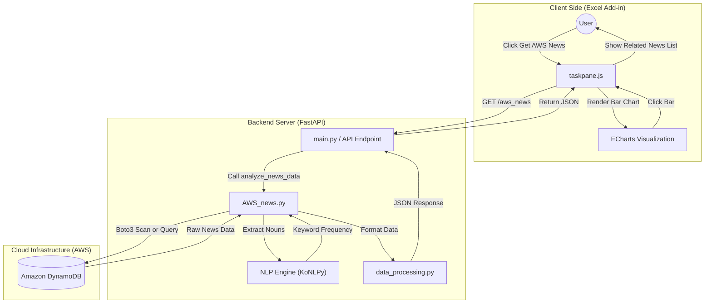
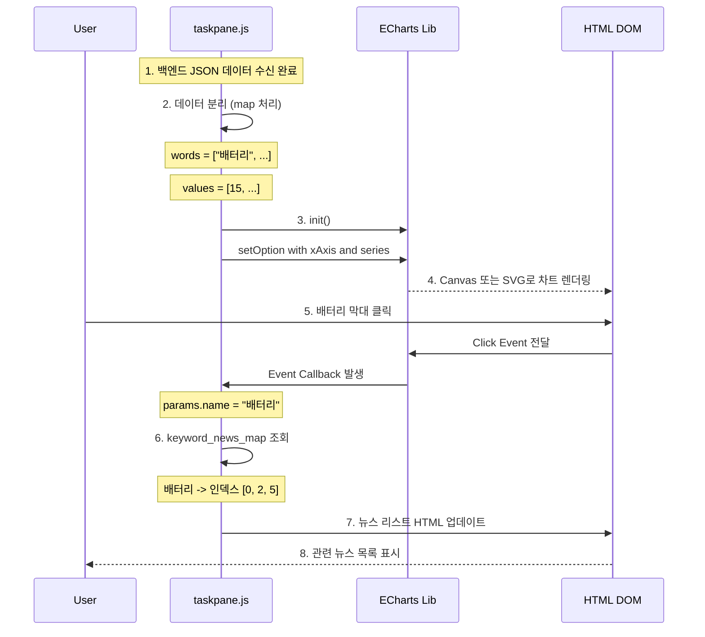

# AWS 뉴스 데이터 시각화 (Market Insight)

## 요약

- **기능:** AWS DynamoDB에 수집된 뉴스 데이터를 분석하여, 현재 시장에서 가장 핫한 **키워드(Top Keywords)**와 관련 뉴스를 보여줍니다.
- **작동 방식:**
    1. 사용자가 `Get AWS News` 버튼 클릭 (`aws-news`).
    2. [getAwsNews()](vscode-file://vscode-app/c:/Users/%EC%86%90%EB%AF%BC%EA%B5%AC/AppData/Local/Programs/Microsoft%20VS%20Code/resources/app/out/vs/code/electron-browser/workbench/workbench.html) 함수가 백엔드(`/aws_news`) 호출.
    3. 백엔드가 DynamoDB에서 데이터를 가져와 분석 후 반환.
    4. [renderAwsNewsChart()](vscode-file://vscode-app/c:/Users/%EC%86%90%EB%AF%BC%EA%B5%AC/AppData/Local/Programs/Microsoft%20VS%20Code/resources/app/out/vs/code/electron-browser/workbench/workbench.html)가 Taskpane 내부에 **ECharts 바 차트**로 키워드 빈도수를 시각화.
    5. 차트의 막대를 클릭하면 하단에 관련 뉴스 리스트 표시.

##  AWS News Visualization Architecture




이 다이어그램은 사용자가 버튼을 클릭했을 때부터, AWS DB 조회, NLP 분석을 거쳐 다시 엑셀에 차트가 그려지기까지의 전체 흐름을 보여줍니다.
### 상세과정

#### 백엔드 데이터 처리 과정 (Backend Data Processing)


백엔드(`main.py`, `AWS_news.py`, `data_processing.py`)에서는 단순히 데이터를 가져오는 것을 넘어, **비정형 텍스트 데이터(뉴스)를 분석하여 정량적 데이터(키워드 빈도)로 변환**하는 과정이 수행됩니다.

##### Step 1: 데이터 수집 (Fetching from Cloud)

- **파일:** `AWS_news.py`
- **역할:** AWS SDK인 `boto3`를 사용하여 클라우드 데이터베이스인 **DynamoDB**(`gut_test_2` 테이블)에 접속합니다.
- **로직:** 저장된 뉴스 데이터(제목, 날짜 등)를 쿼리하거나 스캔하여 가져옵니다.

##### Step 2: 자연어 처리 및 키워드 추출 (NLP Analysis)

- **파일:** `AWS_news.py`
- **라이브러리:** `Konlpy` (한국어 정보처리 패키지)의 `Okt` (Open Korean Text) 형태소 분석기 사용.
- **로직:**
    1. `Okt.nouns()` 함수를 사용하여 텍스트에서 **명사(Noun)**만 추출합니다.
```python
    # 형태소(명사) 추출 함수
    def tokenize_titles(df):
        all_tokens = []
        for title in df['title']:
            tokens = okt.nouns(title)
            all_tokens.extend(tokens)
        return all_tokens
```
    1. 의미 없는 단어(길이가 1인 단어등)를 제거하는 전처리 과정을 거칩니다.
``` python
# ...existing code...
    # df1 (오늘)의 단어 빈도 분석
    tokens_t = tokenize_titles(df1)
    word_counts_t = Counter(tokens_t)
    
    # 여기서 필터링이 일어납니다.
    filtered_words_t = {
        word: count for word, count in word_counts_t.items()
        if len(word) > 1 and count >= 5  # <--- 이 부분입니다.
    }
# ...existing code...
```
##### Step 3: 빈도수 분석 (Frequency Counting)

- **파일:** `AWS_news.py`
- **라이브러리:** Python 내장 `collections.Counter`
- **로직:**
    1. 추출된 명사들의 리스트를 `Counter`에 넣어 단어별 등장 횟수를 계산합니다.
    2. `most_common(20)` 등을 사용하여 상위 키워드를 추출합니다.
    3. **역색인(Inverted Index) 생성:** 사용자가 차트에서 키워드를 클릭했을 때 관련 뉴스를 보여주기 위해, `{ '키워드': [뉴스_인덱스_리스트] }` 형태의 맵(Map)을 생성합니다.

##### Step 4: 데이터 포맷팅 (Response Formatting)

- **파일:** `data_processing.py` (`process_aws_news_data` 함수)
- **로직:** 프론트엔드(ECharts)가 바로 사용할 수 있는 JSON 형태로 데이터를 가공합니다.
```json
{
    "keywords": [
        {"word": "배터리", "value": 15},
        {"word": "전기차", "value": 12}
    ],
    "keyword_news_map": {
        "배터리": [0, 2, 5],  // 0, 2, 5번 뉴스가 '배터리' 관련임
        "전기차": [1, 3]
    },
    "news_data": [ ...뉴스 원본 리스트... ]
}
```


#### 프론트엔드 시각화 과정





##### Step 1: 데이터 수신 및 파싱

`taskpane.js`의 `getAwsNews()` 함수에서 백엔드로부터 받은 JSON은 다음과 같은 자바스크립트 객체가 됩니다.
```json
// data (result) 객체 예시
{
    "keywords": [
        {"word": "배터리", "value": 15}, {"word": "전기차", "value": 12}, ...
    ],
    "news_data": [ ...뉴스 객체들... ],
    "keyword_news_map": { "배터리": [0, 2], "전기차": [1] }
}
```

#### Step 2: ECharts용 데이터 분리 (Data Preparation)

`renderAwsNewsChart(data)` 함수 내부에서 ECharts의 **X축(단어)**과 **Y축(빈도수)**에 들어갈 데이터를 배열로 분리합니다.

```javascript
// 상위 20개만 자름
const topKeywords = data.keywords.slice(0, 20);

// map 함수를 이용해 배열 추출
const words = topKeywords.map(item => item.word);   // 결과: ["배터리", "전기차", ...] -> X축
const values = topKeywords.map(item => item.value); // 결과: [15, 12, ...] -> Y축 (Series Data)
```


#### Step 3: 차트 옵션 설정 (Configuration)

ECharts는 `option`이라는 설정 객체를 통해 차트의 모양을 결정합니다.

```javascript
const option = {
    xAxis: {
        type: 'category',
        data: words, // ["배터리", "전기차"...] 가 여기에 들어갑니다.
        // ...스타일 설정...
    },
    yAxis: {
        type: 'value' // 수치형 축
    },
    series: [{
        data: values, // [15, 12...] 가 여기에 들어갑니다.
        type: 'bar',  // 막대 그래프 지정
        itemStyle: { color: '#89CFF0' } // 색상 지정
    }],
    // ...tooltip 등 기타 설정...
};
```

#### Step 4: 렌더링 (Rendering)

설정된 옵션을 차트 인스턴스에 주입하면 화면에 그려집니다.

```javascript
const chart = echarts.init(document.getElementById('chart-container'));
chart.setOption(option); // 이 시점에 화면에 그래프가 짠! 하고 나타납니다.
```


### 결과

당일 핫한 뉴스 키워드를 엑셀 taskpane에 시각화 한 모습

![[Pasted image 20251222110916.png]]