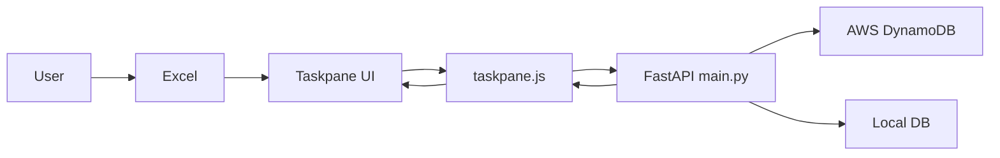

# Excel Add-in 과 FastAPI 간 REST API 통신 구현
## 로직 요약 (Summary)

Excel Add-in 프론트엔드([taskpane.js](vscode-file://vscode-app/c:/Users/%EC%86%90%EB%AF%BC%EA%B5%AC/AppData/Local/Programs/Microsoft%20VS%20Code/resources/app/out/vs/code/electron-browser/workbench/workbench.html))에서 **HTTP + JSON** 기반으로 FastAPI 백엔드([main.py](vscode-file://vscode-app/c:/Users/%EC%86%90%EB%AF%BC%EA%B5%AC/AppData/Local/Programs/Microsoft%20VS%20Code/resources/app/out/vs/code/electron-browser/workbench/workbench.html))에 요청을 보내고, 백엔드는 처리 결과를 JSON으로 응답합니다. 주요 엔드포인트는 **AWS 뉴스 조회(GET)**, **차트 데이터 조회(POST)**, **차트 데이터 저장 트리거(POST)** 3개이며, 엑셀에서 선택한 셀 값(종목 리스트)을 그대로 API 요청 바디로 전달하는 구조입니다.

## 아키텍처 (Architecture)

프론트엔드는 Office.js로 엑셀에서 선택된 범위를 읽고, [fetch](vscode-file://vscode-app/c:/Users/%EC%86%90%EB%AF%BC%EA%B5%AC/AppData/Local/Programs/Microsoft%20VS%20Code/resources/app/out/vs/code/electron-browser/workbench/workbench.html)로 FastAPI 엔드포인트를 호출합니다. 백엔드는 요청 바디를 AWS DynamoDB 조회 또는 로컬 DB 저장/조회 로직을 수행하고 JSON을 반환합니다.




## 상세 과정 (Detailed Steps)

**1. 프론트엔드에서 엑셀 선택 범위 값을 읽어 API 입력으로 사용**  
[run()](vscode-file://vscode-app/c:/Users/%EC%86%90%EB%AF%BC%EA%B5%AC/AppData/Local/Programs/Microsoft%20VS%20Code/resources/app/out/vs/code/electron-browser/workbench/workbench.html)과 [save()](vscode-file://vscode-app/c:/Users/%EC%86%90%EB%AF%BC%EA%B5%AC/AppData/Local/Programs/Microsoft%20VS%20Code/resources/app/out/vs/code/electron-browser/workbench/workbench.html)는 공통적으로 [Excel.run](vscode-file://vscode-app/c:/Users/%EC%86%90%EB%AF%BC%EA%B5%AC/AppData/Local/Programs/Microsoft%20VS%20Code/resources/app/out/vs/code/electron-browser/workbench/workbench.html)에서 선택된 셀의 [range.values](vscode-file://vscode-app/c:/Users/%EC%86%90%EB%AF%BC%EA%B5%AC/AppData/Local/Programs/Microsoft%20VS%20Code/resources/app/out/vs/code/electron-browser/workbench/workbench.html)를 읽고, 이를 백엔드로 전송하는 함수([fetchDataFromBackend](vscode-file://vscode-app/c:/Users/%EC%86%90%EB%AF%BC%EA%B5%AC/AppData/Local/Programs/Microsoft%20VS%20Code/resources/app/out/vs/code/electron-browser/workbench/workbench.html), [saveDataToDB](vscode-file://vscode-app/c:/Users/%EC%86%90%EB%AF%BC%EA%B5%AC/AppData/Local/Programs/Microsoft%20VS%20Code/resources/app/out/vs/code/electron-browser/workbench/workbench.html))를 호출합니다.

**Code Snippet: [taskpane.js](vscode-file://vscode-app/c:/Users/%EC%86%90%EB%AF%BC%EA%B5%AC/AppData/Local/Programs/Microsoft%20VS%20Code/resources/app/out/vs/code/electron-browser/workbench/workbench.html) - run, save**
```javascript
export async function run() {
  try {
    await Excel.run(async (context) => {
      const range = context.workbook.getSelectedRange();
      // Read the range address
      range.load(["address", "values"]);
      
      await context.sync();
      const stockNames = range.values //백엔드로 보낼 데이터(json변환 전)
      console.log(`선택된 범위의 주소: ${range.address}, 값: ${stockNames}`);

      //////////////////////////////////////////////////////////////////////
      // 2. 백엔드 통신 함수 호출 (Excel.run 외부)
      const chartData = await fetchDataFromBackend(stockNames)
      // 3. dialog열기 (Excel.run 외부)
      await renderChartInDialog(chartData);
      //////////////////////////////////////////////////////////////////////

    });
}

export async function save() {
  try {
    await Excel.run(async (context) => {
      const range = context.workbook.getSelectedRange();

      // Read the range address
      range.load(["address", "values"]);

      await context.sync();
      const stockNames = range.values //백엔드로 보낼 데이터(json변환 전)
      console.log(`선택된 범위의 주소: ${range.address}, 값: ${stockNames}`);

      //////////////////////////////////////////////////////////////////////
      // 2. 백엔드 통신 함수 호출 (Excel.run 외부)
      await saveDataToDB(stockNames)
    });

```

**2. AWS 뉴스는 GET으로 조회하고, 결과(JSON)를 ECharts로 시각화**  
[getAwsNews()](vscode-file://vscode-app/c:/Users/%EC%86%90%EB%AF%BC%EA%B5%AC/AppData/Local/Programs/Microsoft%20VS%20Code/resources/app/out/vs/code/electron-browser/workbench/workbench.html)는 `GET /aws_news`로 백엔드에서 분석 결과를 받아오고, [renderAwsNewsChart()](vscode-file://vscode-app/c:/Users/%EC%86%90%EB%AF%BC%EA%B5%AC/AppData/Local/Programs/Microsoft%20VS%20Code/resources/app/out/vs/code/electron-browser/workbench/workbench.html)가 ECharts 옵션을 구성해 차트를 그립니다.

**Code Snippet: [taskpane.js](vscode-file://vscode-app/c:/Users/%EC%86%90%EB%AF%BC%EA%B5%AC/AppData/Local/Programs/Microsoft%20VS%20Code/resources/app/out/vs/code/electron-browser/workbench/workbench.html) - getAwsNews**
```javascript
export async function getAwsNews() {
    const backendUrl = `http://localhost:8000/aws_news`; // AWS News 엔드포인트

    try {
        console.log("Fetching AWS news...");
        
        const response = await fetch(backendUrl, {
            method: "GET", // GET 요청
            headers: {
                "Content-Type": "application/json",
            }
        });

        const result = await response.json();
        console.log("AWS news retrieved successfully:", result);
        
        // 차트 데이터 준비 및 렌더링
        renderAwsNewsChart(result);
        
    } 
}
```


**3. 차트 데이터 조회는 POST로 요청하고 응답의 chart_data를 사용**  
[fetchDataFromBackend()](vscode-file://vscode-app/c:/Users/%EC%86%90%EB%AF%BC%EA%B5%AC/AppData/Local/Programs/Microsoft%20VS%20Code/resources/app/out/vs/code/electron-browser/workbench/workbench.html)는 `POST /get_chart_data`로 [value](vscode-file://vscode-app/c:/Users/%EC%86%90%EB%AF%BC%EA%B5%AC/AppData/Local/Programs/Microsoft%20VS%20Code/resources/app/out/vs/code/electron-browser/workbench/workbench.html)(2차원 배열)를 전송합니다. 응답에서 [data.chart_data](vscode-file://vscode-app/c:/Users/%EC%86%90%EB%AF%BC%EA%B5%AC/AppData/Local/Programs/Microsoft%20VS%20Code/resources/app/out/vs/code/electron-browser/workbench/workbench.html)를 반환하여 이후 다이얼로그 차트 렌더링에 사용합니다.

**Code Snippet: [taskpane.js](vscode-file://vscode-app/c:/Users/%EC%86%90%EB%AF%BC%EA%B5%AC/AppData/Local/Programs/Microsoft%20VS%20Code/resources/app/out/vs/code/electron-browser/workbench/workbench.html) - fetchDataFromBackend**
```javascript
async function fetchDataFromBackend(value) {
  const backendUrl = "http://localhost:8000/get_chart_data"; // FastAPI 엔드포인트 주소

  try {
    const response = await fetch(backendUrl, {
      method: "POST", 
      headers: {
        "Content-Type": "application/json", // JSON 형식으로 데이터 전송
      },
      body: JSON.stringify({ value: value }), // 엑셀에서 가져온 값을 JSON 형태로 변환하여 전송
    });

    const data = await response.json(); // 백엔드로부터 받은 JSON 응답 파싱
    console.log("백엔드로부터 받은 데이터:", data);
    return data.chart_data; // 차트 데이터를 반환
  } 
}
```


**4. 차트 데이터 저장 트리거는 POST로 요청하고 백엔드에서 DB 적재 수행**  
[saveDataToDB()](vscode-file://vscode-app/c:/Users/%EC%86%90%EB%AF%BC%EA%B5%AC/AppData/Local/Programs/Microsoft%20VS%20Code/resources/app/out/vs/code/electron-browser/workbench/workbench.html)는 [POST /save_data_to_DB](vscode-file://vscode-app/c:/Users/%EC%86%90%EB%AF%BC%EA%B5%AC/AppData/Local/Programs/Microsoft%20VS%20Code/resources/app/out/vs/code/electron-browser/workbench/workbench.html)로 종목 리스트를 전송하고, 백엔드는 해당 종목들의 분/일 데이터를 수집 및 저장합니다.

**Code Snippet: [taskpane.js](vscode-file://vscode-app/c:/Users/%EC%86%90%EB%AF%BC%EA%B5%AC/AppData/Local/Programs/Microsoft%20VS%20Code/resources/app/out/vs/code/electron-browser/workbench/workbench.html) - saveDataToDB**
```javascript
async function saveDataToDB(value) {
  const backendUrl = "http://localhost:8000/save_data_to_DB"; // FastAPI 엔드포인트 주소

  try {
    const response = await fetch(backendUrl, {
      method: "POST", 
      headers: {
        "Content-Type": "application/json", // JSON 형식으로 데이터 전송
      },
      body: JSON.stringify({ value: value }), // 엑셀에서 가져온 값을 JSON 형태로 변환하여 전송
    });

    const data = await response.json(); // 백엔드로부터 받은 JSON 응답 파싱
    console.log("백엔드로부터 받은 데이터:", data);
    return data
  } 
}
```


**5. 백엔드는 FastAPI 라우트로 요청을 받고, Pydantic 모델로 입력을 파싱한 뒤 처리**  
[Item](vscode-file://vscode-app/c:/Users/%EC%86%90%EB%AF%BC%EA%B5%AC/AppData/Local/Programs/Microsoft%20VS%20Code/resources/app/out/vs/code/electron-browser/workbench/workbench.html) 모델이 value: List[List[str]]를 받도록 정의되어 있고, [/save_data_to_DB](vscode-file://vscode-app/c:/Users/%EC%86%90%EB%AF%BC%EA%B5%AC/AppData/Local/Programs/Microsoft%20VS%20Code/resources/app/out/vs/code/electron-browser/workbench/workbench.html)와 `/get_chart_data`는 이를 받아 [flat_values](vscode-file://vscode-app/c:/Users/%EC%86%90%EB%AF%BC%EA%B5%AC/AppData/Local/Programs/Microsoft%20VS%20Code/resources/app/out/vs/code/electron-browser/workbench/workbench.html)로 평탄화한 뒤 후속 처리를 수행합니다. `/aws_news`는 GET으로 분석 결과를 반환합니다.

**Code Snippet: [main.py](vscode-file://vscode-app/c:/Users/%EC%86%90%EB%AF%BC%EA%B5%AC/AppData/Local/Programs/Microsoft%20VS%20Code/resources/app/out/vs/code/electron-browser/workbench/workbench.html) - Item, 엔드포인트**
```python
class Item(BaseModel):
    value: List[List[str]]

@app.post("/save_data_to_DB")
async def save_data_to_DB(item: Item):
    flat_values = [name for sublist in item.value for name in sublist]
    TICKER_MAPPING = stock_cache._name_to_ticker
    result_minute = await asyncio.to_thread(process_and_save_minute,flat_values, ACCESS_TOKEN, TICKER_MAPPING)
    result_daily = await asyncio.to_thread(process_and_save_daily,flat_values, ACCESS_TOKEN, TICKER_MAPPING)
    return result_minute

@app.post("/get_chart_data")
async def process_excel_data(item: Item):
    flat_values = [name for sublist in item.value for name in sublist]
    minute_data = get_minute_data_from_DB(flat_values)
    result = prepare_chart_payload(minute_data)
    return {"message": "Data processed successfully", "chart_data": result}

@app.get("/aws_news")
async def get_aws_news():
    try:
        df_today, sorted_ratios = analyze_news_data()
        result = process_aws_news_data(df_today, sorted_ratios)
        return result
    except Exception as e:
        logger.error(f"AWS 뉴스 데이터 분석 중 오류 발생: {e}")
        raise HTTPException(status_code=500, detail=f"AWS 뉴스 데이터 분석 실패: {str(e)}")
```

## 결론

- AWS 뉴스는 **GET 조회**로 단순화하고, 종목 리스트처럼 페이로드가 커질 수 있는 요청은 **POST 바디(JSON)**로 전달하여 URL 길이/표현 한계를 피하는 구조입니다.

차트데이터를 조회하여 시각화된  모습

![[Pasted image 20250603195432.png]]

줌, 팬기능으로 인터렉티브하게 조작된 모습

![[Pasted image 20250603195447.png]]
