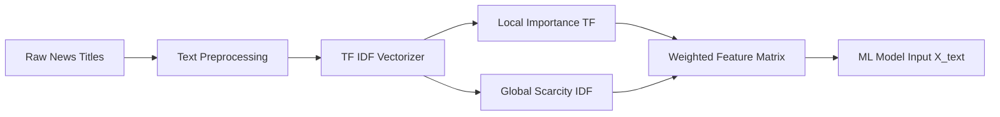

# 금융 뉴스 텍스트의 수치화를 위한 TF IDF 벡터화 (TF-IDF Vectorization)

## 로직 요약 (Summary)

뉴스 제목과 같은 비정형 텍스트 데이터를 머신러닝 모델이 학습할 수 있는 수치 행렬로 변환하는 전처리 과정입니다. 단순 빈도(Count)가 아닌 **단어의 희소성(Scarcity)**을 함께 고려하여, 모든 뉴스에 흔하게 등장하는 노이즈('속보', '주식' 등)는 제거하고 주가에 실질적 영향을 미치는 핵심 키워드('임상', '수주' 등)에 높은 가중치를 부여합니다.

## 아키텍처 (Architecture)

텍스트 데이터가 전처리를 거쳐 TF(단어 빈도)와 IDF(역문서 빈도)의 결합을 통해 최종적인 Feature Matrix로 변환되는 흐름입니다.



## 상세 과정 (Detailed Steps)

**1. 불용어(Stop Words) 정의 및 벡터라이저 초기화**  
금융 뉴스에서 빈번하게 등장하지만 정보 가치가 낮은 단어들을 불용어로 정의하고, 상위 200개의 핵심 단어만 추출하도록 `TfidfVectorizer`를 설정합니다.

**Code Snippet: [test3(classification).ipynb](vscode-file://vscode-app/c:/Users/%EC%86%90%EB%AF%BC%EA%B5%AC/AppData/Local/Programs/Microsoft%20VS%20Code/resources/app/out/vs/code/electron-browser/workbench/workbench.html)**

```python
# 제거하고 싶은 특정 단어 목록을 직접 정의
custom_stop_words = [
    "주식", "소유", "변동", "증권", "52", "주주", "경신", "고가",
    "ᆫ다", "주요", "임원", "2025", "으로", "리포트", "브리핑",
    "목표", "보유자", "외국인",
    "전일", "10", "까지", "돌파", "생생", "100", "생쇼", "에서", "25", "강세",
    "pick", "나서", "not", "rated", "tops", "gc", "주년", "20", "buy", "50"
]
# 벡터화
vec = TfidfVectorizer(max_features=200, stop_words=custom_stop_words)
```

**2. TF-IDF 행렬 변환 및 데이터프레임 생성**  
전처리된 뉴스 제목(`processed_title`)을 학습하여 수치 행렬로 변환(`fit_transform`)하고, 이를 컬럼명이 포함된 DataFrame 형태로 재구성합니다.

**Code Snippet: [test3(classification).ipynb](vscode-file://vscode-app/c:/Users/%EC%86%90%EB%AF%BC%EA%B5%AC/AppData/Local/Programs/Microsoft%20VS%20Code/resources/app/out/vs/code/electron-browser/workbench/workbench.html)**

```python
# vec = TfidfVectorizer(vocabulary=top_text_features)
mat = vec.fit_transform(df['processed_title'])
X_text = pd.DataFrame(mat.toarray(), columns=vec.get_feature_names_out())
```

**3. 벡터라이저 저장 (재사용 목적)**  
학습된 벡터라이저 객체를 파일로 저장하여, 추후 추론(Inference) 단계에서 새로운 뉴스 데이터에 동일한 기준을 적용할 수 있도록 합니다.

**Code Snippet: [test3(classification).ipynb](vscode-file://vscode-app/c:/Users/%EC%86%90%EB%AF%BC%EA%B5%AC/AppData/Local/Programs/Microsoft%20VS%20Code/resources/app/out/vs/code/electron-browser/workbench/workbench.html)**

```python
# 벡터라이저 저장
from pathlib import Path
import joblib

vectorizer_dir = Path("analysis/vectorizer")
vectorizer_dir.mkdir(parents=True, exist_ok=True)
joblib.dump(vec, vectorizer_dir / "tfidf_vectorizer_1011.pkl")
```

## 결과/효과 (Results/Impact)

"단순 빈도 분석 대비 노이즈(공통 단어)를 효과적으로 필터링하여 모델의 과적합을 방지했으며, 상위 200개의 핵심 키워드만을 추출하여 연산 효율성을 확보했습니다."