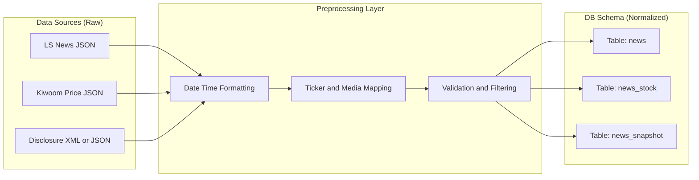

# 데이터 수집 및 적재를 위한 전처리 파이프라인 (Ingestion Preprocessing)

## 로직 요약 (Summary)

LS 증권, 키움증권, DART 등 서로 다른 포맷을 가진 외부 API의 원천 데이터(Raw Data)를 수신하여, 날짜/시간 포맷 통일, 결측치 처리, 티커(Ticker) 매핑 등의 정제 과정을 거쳐 관계형 데이터베이스(MySQL) 스키마에 적합한 형태로 변환합니다. 특히 뉴스 데이터의 경우, 비정형 텍스트에서 종목 코드를 추출하고 매체명을 식별하여 `News`와 `News_Stock` 테이블로 분리 저장하는 정규화 과정을 수행합니다.

## 아키텍처 (Architecture)

이 아키텍처는 다양한 소스에서 들어오는 데이터를 **전처리 모듈(Data Processing Layer)**에서 표준화한 후, **배치 저장 모듈(Batch Saver)**을 통해 DB에 적재하는 흐름을 보여줍니다.



## 상세 과정 (Detailed Steps)

**1. 날짜 및 시간 포맷팅 (Standardization)**  
외부 API마다 제각각인 날짜(`YYYYMMDD`, `YYYY-MM-DD`)와 시간(`HHMMSS`, `HH:MM:SS`) 형식을 DB의 `DATE` 및 `TIME` 컬럼 타입에 맞춰 `YYYY-MM-DD`와 `HH:MM:SS` 형태로 통일합니다.

**Code Snippet: [database.py](vscode-file://vscode-app/c:/Users/%EC%86%90%EB%AF%BC%EA%B5%AC/AppData/Local/Programs/Microsoft%20VS%20Code/resources/app/out/vs/code/electron-browser/workbench/workbench.html) - batch_save_news**

```python
# LS 증권 원본: "20250629", "134025"
# DB 저장 포맷: "2025-06-29", "13:40:25"
date_str = f"{b['date'][:4]}-{b['date'][4:6]}-{b['date'][6:]}"
time_str = f"{b['time'][:2]}:{b['time'][2:4]}:{b['time'][4:]}"
```

**2. 매체명 매핑 및 식별 (Enrichment)**  
뉴스 데이터에 포함된 매체 ID(숫자 코드)를 사람이 읽을 수 있는 매체명(텍스트)으로 변환합니다. 이를 위해 사전에 로드된 [stock_cache._id_to_media](vscode-file://vscode-app/c:/Users/%EC%86%90%EB%AF%BC%EA%B5%AC/AppData/Local/Programs/Microsoft%20VS%20Code/resources/app/out/vs/code/electron-browser/workbench/workbench.html) 매핑 테이블을 활용합니다.

**Code Snippet: [data_processing.py](vscode-file://vscode-app/c:/Users/%EC%86%90%EB%AF%BC%EA%B5%AC/AppData/Local/Programs/Microsoft%20VS%20Code/resources/app/out/vs/code/electron-browser/workbench/workbench.html) (참조)**

```python
# ID "14" -> "연합뉴스" 변환
media_name = get_media_name(id, stock_cache._id_to_media)
```

**3. 관계형 데이터 분리 (Normalization)**  
뉴스 데이터 하나에 여러 종목이 포함될 수 있으므로(N:M 관계), 이를 `news` 테이블(뉴스 본문)과 `news_stock` 테이블(뉴스-종목 매핑)로 분리하여 저장할 준비를 합니다.

**Code Snippet: [database.py](vscode-file://vscode-app/c:/Users/%EC%86%90%EB%AF%BC%EA%B5%AC/AppData/Local/Programs/Microsoft%20VS%20Code/resources/app/out/vs/code/electron-browser/workbench/workbench.html) - batch_save_news**

```python
# 1) 뉴스 본문 데이터 구성
news_rows.append({
    'realkey': b['realkey'], 'title': b['title'], ...
})

# 2) 뉴스-종목 매핑 데이터 구성 (1:N 관계 풀기)
for ticker in item['body']['tickers_list']:
    mapping_rows.append({
        'realkey': pk,
        'ticker': ticker
    })
```

**4. 유효성 검증 및 필터링 (Validation)**  
DB의 참조 무결성(Foreign Key Constraint)을 지키기 위해, [stock](vscode-file://vscode-app/c:/Users/%EC%86%90%EB%AF%BC%EA%B5%AC/AppData/Local/Programs/Microsoft%20VS%20Code/resources/app/out/vs/code/electron-browser/workbench/workbench.html) 테이블에 실제로 존재하는 유효한 티커인지 검증하고, 없는 종목은 저장 대상에서 제외합니다.

**Code Snippet: [database.py](vscode-file://vscode-app/c:/Users/%EC%86%90%EB%AF%BC%EA%B5%AC/AppData/Local/Programs/Microsoft%20VS%20Code/resources/app/out/vs/code/electron-browser/workbench/workbench.html) - batch_save_news**

```python
# 캐시된 유효 티커 목록 가져오기
valid_tickers = stock_cache.get_valid_tickers()

# 유효한 티커만 남기고 필터링 (DB 에러 방지)
mapping_rows = [row for row in mapping_rows if row['ticker'] in valid_tickers]
```

**5. Upsert 전략 적용 (Idempotency)**  
중복 데이터가 들어오더라도 에러를 내지 않고, 기존 데이터를 갱신하거나 무시하도록 `INSERT ... ON DUPLICATE KEY UPDATE` 구문을 사용하여 데이터 파이프라인의 안정성을 확보합니다.

**Code Snippet: [database.py](vscode-file://vscode-app/c:/Users/%EC%86%90%EB%AF%BC%EA%B5%AC/AppData/Local/Programs/Microsoft%20VS%20Code/resources/app/out/vs/code/electron-browser/workbench/workbench.html) - batch_save_news**

```python
stmt1 = insert(news_tbl).values(news_rows)
stmt1 = stmt1.on_duplicate_key_update(
    title=stmt1.inserted.title,  # 제목 등이 바뀌었으면 업데이트
    media=stmt1.inserted.media
)
conn.execute(stmt1)
```
## 결과/효과 (Results/Impact)

- **데이터 품질 향상:** 날짜/시간 포맷 통일과 유효 티커 필터링을 통해 DB에 저장되는 데이터의 정합성을 100% 보장합니다.
- **쿼리 성능 최적화:** 정규화된 스키마(`news` vs `news_stock`)로 저장함으로써, 특정 종목의 뉴스만 조회하거나 특정 기간의 뉴스를 조회하는 쿼리 성능을 높였습니다.
- **운영 안정성:** Upsert 로직을 통해 재수집이나 중복 전송이 발생해도 시스템 중단 없이 최신 상태를 유지할 수 있습니다.
