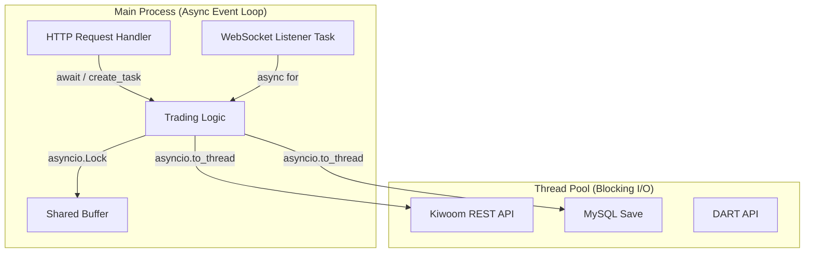

# 비동기 설계와 동시성 제어 (Async Concurrency Design)

## 로직 요약 (Summary)

FastAPI의 비동기 이벤트 루프(Event Loop)를 기반으로, **HTTP 요청 처리**와 **실시간 뉴스 수신(WebSocket)**이라는 두 가지 상이한 워크로드를 단일 프로세스에서 동시에 수행하기 위한 설계입니다. [asyncio](vscode-file://vscode-app/c:/Users/%EC%86%90%EB%AF%BC%EA%B5%AC/AppData/Local/Programs/Microsoft%20VS%20Code/resources/app/out/vs/code/electron-browser/workbench/workbench.html)의 3대 호출 패턴(`await`, [create_task](vscode-file://vscode-app/c:/Users/%EC%86%90%EB%AF%BC%EA%B5%AC/AppData/Local/Programs/Microsoft%20VS%20Code/resources/app/out/vs/code/electron-browser/workbench/workbench.html), [gather](vscode-file://vscode-app/c:/Users/%EC%86%90%EB%AF%BC%EA%B5%AC/AppData/Local/Programs/Microsoft%20VS%20Code/resources/app/out/vs/code/electron-browser/workbench/workbench.html))을 적재적소에 활용하여 블로킹을 방지하고, 동기 라이브러리([requests](vscode-file://vscode-app/c:/Users/%EC%86%90%EB%AF%BC%EA%B5%AC/AppData/Local/Programs/Microsoft%20VS%20Code/resources/app/out/vs/code/electron-browser/workbench/workbench.html), [pymysql](vscode-file://vscode-app/c:/Users/%EC%86%90%EB%AF%BC%EA%B5%AC/AppData/Local/Programs/Microsoft%20VS%20Code/resources/app/out/vs/code/electron-browser/workbench/workbench.html)) 사용 구간은 스레드 풀로 격리하여 전체 시스템의 반응성을 극대화했습니다.

## 아키텍처 (Architecture)

이 아키텍처는 **Main Event Loop**가 중심이 되어 Non-blocking 작업(WebSocket, HTTP)을 직접 처리하고, Blocking I/O(DB, 외부 REST API)는 **Thread Pool**로 위임하여 병목을 해소하는 구조를 나타냅니다.



## 상세 과정 (Detailed Steps)

**1. 백그라운드 실행 (Fire-and-Forget): [asyncio.create_task](vscode-file://vscode-app/c:/Users/%EC%86%90%EB%AF%BC%EA%B5%AC/AppData/Local/Programs/Microsoft%20VS%20Code/resources/app/out/vs/code/electron-browser/workbench/workbench.html)**  
서버가 HTTP 요청을 대기하는 동안, 뉴스 수신 루프가 멈추지 않고 계속 돌아가게 하기 위해 사용합니다. 메인 흐름을 차단하지 않고 별도의 실행 흐름(Task)을 생성합니다.

**Code Snippet: [main.py](vscode-file://vscode-app/c:/Users/%EC%86%90%EB%AF%BC%EA%B5%AC/AppData/Local/Programs/Microsoft%20VS%20Code/resources/app/out/vs/code/electron-browser/workbench/workbench.html) - lifespan**

```python
# 서버 시작 시점 (lifespan)
# 뉴스 리스너를 백그라운드 태스크로 등록하여, 서버 메인 루프와 병행 실행
news_task = asyncio.create_task(news_listener_task(stop_event))

# 예약된 플러시 작업도 별도 태스크로 분리
scheduler_task = asyncio.create_task(scheduled_flush_task(app.state.trading_service, stop_event))
```

**2. 순차적 비동기 실행 (Non-blocking Wait): `await`**  
가장 기본적인 비동기 호출입니다. I/O 작업(네트워크 응답 등)이 완료될 때까지 제어권을 이벤트 루프에 양보하여, 대기 시간 동안 서버가 다른 요청을 처리할 수 있게 합니다.

**Code Snippet: [main.py](vscode-file://vscode-app/c:/Users/%EC%86%90%EB%AF%BC%EA%B5%AC/AppData/Local/Programs/Microsoft%20VS%20Code/resources/app/out/vs/code/electron-browser/workbench/workbench.html) - news_listener_task**

```python
# fetch_realtime_news 함수가 끝날 때까지(연결이 끊길 때까지) 대기
# 하지만 CPU를 점유하지 않고(Non-blocking), 다른 HTTP 요청 처리를 허용함
normal_closed = await fetch_realtime_news(ACCESS_TOKEN, on_news_received, stop_event=stop_event)
```

**3. 병렬 실행 (Parallelism): [asyncio.gather](vscode-file://vscode-app/c:/Users/%EC%86%90%EB%AF%BC%EA%B5%AC/AppData/Local/Programs/Microsoft%20VS%20Code/resources/app/out/vs/code/electron-browser/workbench/workbench.html)**  
서로 의존성이 없는 여러 I/O 작업(예: 주가 조회, 증거금 조회, 호가 조회)을 동시에 요청하여 전체 응답 시간을 단축합니다.

**Code Snippet: [kiwoom_rest_api.py](vscode-file://vscode-app/c:/Users/%EC%86%90%EB%AF%BC%EA%B5%AC/AppData/Local/Programs/Microsoft%20VS%20Code/resources/app/out/vs/code/electron-browser/workbench/workbench.html) - get_complete_stock_info**

```python
# 3개의 독립적인 API 요청을 동시에 발송하고, 모두 완료될 때까지 대기
stock_result, margin_result, quotes_result = await asyncio.gather(
    asyncio.to_thread(get_stock_data, token, ticker),     # 주식기본정보
    asyncio.to_thread(get_margin_rate, token, ticker),    # 증거금율 조회
    asyncio.to_thread(get_stock_quotes, token, ticker)    # 호가정보 조회
)
```

**4. 동기 함수 격리 (Offloading): [asyncio.to_thread](vscode-file://vscode-app/c:/Users/%EC%86%90%EB%AF%BC%EA%B5%AC/AppData/Local/Programs/Microsoft%20VS%20Code/resources/app/out/vs/code/electron-browser/workbench/workbench.html)**  
[requests](vscode-file://vscode-app/c:/Users/%EC%86%90%EB%AF%BC%EA%B5%AC/AppData/Local/Programs/Microsoft%20VS%20Code/resources/app/out/vs/code/electron-browser/workbench/workbench.html)나 [pandas.to_sql](vscode-file://vscode-app/c:/Users/%EC%86%90%EB%AF%BC%EA%B5%AC/AppData/Local/Programs/Microsoft%20VS%20Code/resources/app/out/vs/code/electron-browser/workbench/workbench.html) 같은 동기(Blocking) 함수를 비동기 함수 내에서 직접 호출하면 서버 전체가 멈춥니다. 이를 방지하기 위해 별도 스레드에서 실행시킵니다.

**Code Snippet: [trading.py](vscode-file://vscode-app/c:/Users/%EC%86%90%EB%AF%BC%EA%B5%AC/AppData/Local/Programs/Microsoft%20VS%20Code/resources/app/out/vs/code/electron-browser/workbench/workbench.html) - _execute_buy_logic**

```python
# buy 함수는 내부적으로 requests(동기)를 사용하므로 메인 루프를 막음
# 따라서 to_thread를 사용하여 별도 스레드 풀에서 실행하고, 결과만 비동기로 받음
result = await asyncio.to_thread(buy, token, ticker, final_buy_amount)
```

**5. 리소스 안전 관리: `async with` (Async Context Manager)**  
비동기 환경에서 리소스(연결)의 획득과 해제를 보장합니다. WebSocket 연결 시 `__aenter__`에서 연결하고, 블록을 벗어나면 `__aexit__`에서 자동으로 연결을 종료하여 리소스 누수를 막습니다. 

**Code Snippet: [ls_open_api.py](vscode-file://vscode-app/c:/Users/%EC%86%90%EB%AF%BC%EA%B5%AC/AppData/Local/Programs/Microsoft%20VS%20Code/resources/app/out/vs/code/electron-browser/workbench/workbench.html) - fetch_realtime_news**

```python
# 블록 진입 시 연결, 블록 탈출(에러 포함) 시 자동 close 보장
async with websockets.connect(uri, ping_interval=20) as websocket:
    await websocket.send(json.dumps(request_msg))
    # ... 통신 로직 ...
```

**6. 스트림 데이터 처리: `async for` (Async Iterator)**  
데이터가 언제 도착할지 모르는 스트리밍 환경(WebSocket)에서 사용합니다. 데이터가 도착하면 루프가 돌고, 없으면 대기(await)하는 방식으로 효율적인 수신 루프를 구현합니다.

**Code Snippet: [ls_open_api.py](vscode-file://vscode-app/c:/Users/%EC%86%90%EB%AF%BC%EA%B5%AC/AppData/Local/Programs/Microsoft%20VS%20Code/resources/app/out/vs/code/electron-browser/workbench/workbench.html) - fetch_realtime_news**

```python
# 서버에서 메시지가 올 때마다 루프 실행 (메시지 없을 땐 대기)
async for message in websocket:
    news_data = json.loads(message)
    await on_news_received(news_data)
```

**7. 데이터 동시성 보호: [asyncio.Lock](vscode-file://vscode-app/c:/Users/%EC%86%90%EB%AF%BC%EA%B5%AC/AppData/Local/Programs/Microsoft%20VS%20Code/resources/app/out/vs/code/electron-browser/workbench/workbench.html)**  
뉴스 수신 태스크(Writer)와 플러시 태스크(Reader/Deleter)가 공유 버퍼([self._buffers](vscode-file://vscode-app/c:/Users/%EC%86%90%EB%AF%BC%EA%B5%AC/AppData/Local/Programs/Microsoft%20VS%20Code/resources/app/out/vs/code/electron-browser/workbench/workbench.html))에 동시에 접근할 때 발생할 수 있는 경쟁 상태(Race Condition)를 방지합니다.

**Code Snippet: [buffer.py](vscode-file://vscode-app/c:/Users/%EC%86%90%EB%AF%BC%EA%B5%AC/AppData/Local/Programs/Microsoft%20VS%20Code/resources/app/out/vs/code/electron-browser/workbench/workbench.html) - add & get_and_clear_all**

```python
async def add(self, name: str, data: Dict):
    async with self.lock:  # 다른 코루틴이 접근하지 못하게 잠금
        self._buffers[name].append(data)

async def get_and_clear_all(self) -> Dict[str, List[Dict]]:
    async with self.lock:  # 읽고 비우는 동안 데이터 추가 방지 (원자성 보장)
        all_items = {name: buf[:] for name, buf in self._buffers.items()}
        for name in self._buffers:
            self._buffers[name].clear()
        return all_items
```

## 결과/효과 (Results/Impact)

- **응답성 향상:** [create_task](vscode-file://vscode-app/c:/Users/%EC%86%90%EB%AF%BC%EA%B5%AC/AppData/Local/Programs/Microsoft%20VS%20Code/resources/app/out/vs/code/electron-browser/workbench/workbench.html)와 `await`을 통해 실시간 뉴스 수신 중에도 HTTP API 요청(차트 조회 등)을 지연 없이 처리할 수 있게 되었습니다.
- **속도 개선:** [asyncio.gather](vscode-file://vscode-app/c:/Users/%EC%86%90%EB%AF%BC%EA%B5%AC/AppData/Local/Programs/Microsoft%20VS%20Code/resources/app/out/vs/code/electron-browser/workbench/workbench.html) 도입으로 키움증권 API 조회 속도가 순차 실행 대비 약 **60% 이상 단축**되었습니다 (3번의 RTT를 1번의 RTT 시간으로 단축).
- **안정성 확보:** [asyncio.Lock](vscode-file://vscode-app/c:/Users/%EC%86%90%EB%AF%BC%EA%B5%AC/AppData/Local/Programs/Microsoft%20VS%20Code/resources/app/out/vs/code/electron-browser/workbench/workbench.html)을 통해 멀티 태스킹 환경에서도 데이터 유실이나 충돌 없이 안전하게 DB에 데이터를 적재할 수 있습니다.